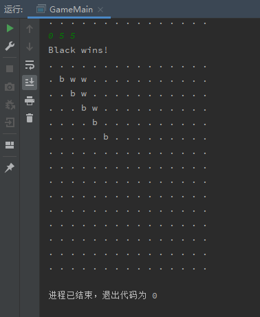
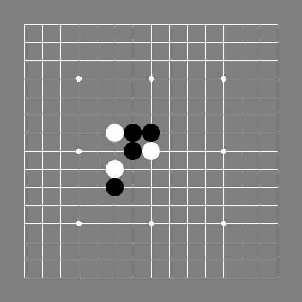
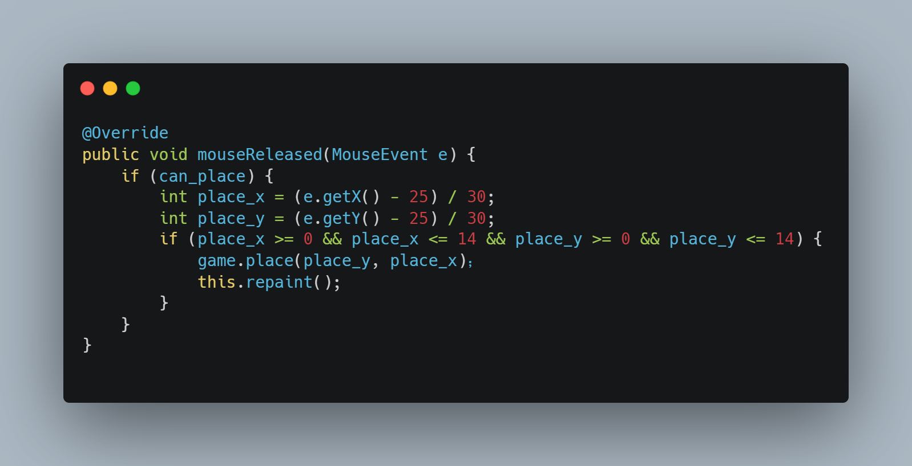

# 基于TCP协议的五子棋

## 二、工具选型

### 1. 工作环境

本项目使用Java语言编写，通过对市面上多款Java IDE进行比较，最终选用了JetBrains公司的IntelliJ IDEA进行开发。其高度智能与集成的环境使开发效率得到明显的提升。

### 2. 网络架构

本项目仅需实现在局域网内的联机游戏，因此采用C/S架构，即服务器-客户机(Client-Server)架构，

## 三、系统设计

### 1. 整体结构

基于上述工具选型，本游戏共分为几大部分：棋局类、客户端、服务端与图形化界面。

### 2. 模块化编程

为了便于各个功能进行对接和后期进行修改，该项目采用了模块化设计，可方便的实现代码复用，且服务端与客户端的游戏底层保持高度一致。

## 四、系统实现

### 1.1 Game（游戏）

游戏作为整个项目最底层的模块，其需要符合简单、通用的特点，为此设计并实现了如下类型：

#### 1.1.1 Chess（棋子）

项目中的棋子使用了枚举类型，该类型可提高代码可读性，便于理解，并且使用 toSting() 函数可快速将其添加至字符串内，便于进行调试。

#### 1.1.2 ChessStep（棋步）

该类型记录了棋子的颜色与位置，便于进行落子、悔棋、复盘等操作。

#### 1.1.3 ChessGame（棋局）

作为整个游戏最基础的部分，该类型包含了落子、悔棋、判断输赢、重置等基本操作的函数。为了便于进行悔棋、复盘，类中采用了 ArrayList 来顺序储存落子顺序。

##### 1.1.3.1 placeChess（落子）

为了简化调用落子函数，该函数可根据落子顺序来自动判断落子颜色，并在每一次落子后进行输赢判断。若提供的落子参数无效会返回落子失败的信息。参考五子棋比赛的相关规则，黑方存在三三禁手、四四禁手、长连禁手的规则。黑方落子在禁手位置同样会返回落子失败的信息。

##### 1.1.3.2 checkWin（输赢判断）

在排除掉禁手落子的情况下，输赢判断只需判断五子相连即可。为了提高运行效率，判断函数并不会遍历整个棋盘，而是按照记录的 steps 进行遍历，减少时间复杂度。

##### 1.1.3.3 reset（重置）

重置函数会将棋局恢复为初始状态，用于重新开始。

##### 1.1.3.4 rewind（悔棋）

悔棋函数会将 steps 的最后一个 ChessStep 删除，并且根据该 ChessStep 中记录的 x 与 y 将棋盘上对应位置的棋子重置为 Empty. 在 steps 为空的情况下则会返回悔棋失败的信息。

##### 1.1.3.5 display *for debug*（显示 *用于debug*）

将棋局打印至控制台，并可输出各种附加调试信息。

至此已完成棋局类的实现，此阶段已可通过命令行进行本地游戏。

### 1.2 GameFrame（游戏窗口）

游戏窗口实现了底层游戏的图形化界面，除了能够显示棋盘外，还配有进行开始游戏、悔棋等操作的功能区。

#### 1.2.1 ChessBoard（棋盘）

该类继承自 JPanel, 并实现了 MouseListener 的方法。实现对用户鼠标输入的响应。

##### 1.2.1.1 paint（绘制）

通过绘制函数来实现棋盘的显示。利用循环绘制15条横线与15条竖线，并在相应位置绘制圆点。最后再根据 ChessBoard 中储存的 steps 进行棋子的绘制。

##### 1.2.1.2 addStep（添加棋步）

使用传入的坐标与颜色参数来向 steps 中加入新的棋步，而后调用 repaint 函数来重绘棋盘，将新加入的棋子绘制在棋盘上。

##### 1.2.1.3 rewind（悔棋）

在需要进行悔棋时调用此函数，此函数会将 steps 中最后一个元素删除，从而达到删除棋盘上最后一步棋的效果，并在此之后调用 repaint 函数进行重绘。

##### 1.2.1.4 @Override mouseReleased（松开鼠标）

使用松开鼠标时触发而非按下鼠标时触发能够有效避免用户的误操作，在按下鼠标后仍有调整落子位置的机会。当可以落子时，该函数会进行鼠标坐标的转换，将像素值计算为棋盘的坐标值，而后直接将此值传入 ChessGame 中的 placeChess 函数。

#### 1.2.2 ActionPanel（功能面板）

功能面板包含了开始游戏、悔棋等操作按钮，通过添加 ActionListener 来实现按下按键后调用游戏对应函数。

### 1.3 网络对战

该部分将实现具有 ChessGame 对象的 Server 与具有 ChessBoard 的 Client, 双方通过TCP协议进行连接，并使用 ChessMsg 类进行数据传输。

#### 1.3.1 MsgType（消息类型）

此处使用枚举类，将各类消息类型列出，增加代码的可读性，便于进行调试。

#### 1.3.2 ChessMsg（棋局消息）

该类中包含 MsgType 类的成员 type, 两个整数类型成员 x 与 y, 和一个 Chess 类的成员 chess. 具有来自于 String 类型的构造函数，并且重写了 toString() 方法，便于将其编码为字符串或从字符串解码，从而用于网络传输。

#### 1.3.3 连接流程

首先服务端启动，等待客户端进行连接。在客户端连接后，根据当前连接情况对客户端进行分配，可分配的类型有：HOST, CLIENT, BYSTANDER. 并将分配情况返回至客户端。客户端对返回值进行响应，等待用户发送准备消息。双方均准备好后，服务端向客户端发送游戏开始消息。之后客户端将用户落子位置消息发送至服务端，服务端对此消息进行响应并广播。客户端再次响应广播消息。在一方提出悔棋时，将悔棋请求发送至服务端，服务端进行转发。另一方客户端对转发消息进行响应后发送是否同意消息，服务器进行处理并对处理结果进行广播。在游戏结束后，服务器对游戏结果进行广播。一方退出后，游戏会进行重置，并再次等待新的客户端进行连接。

